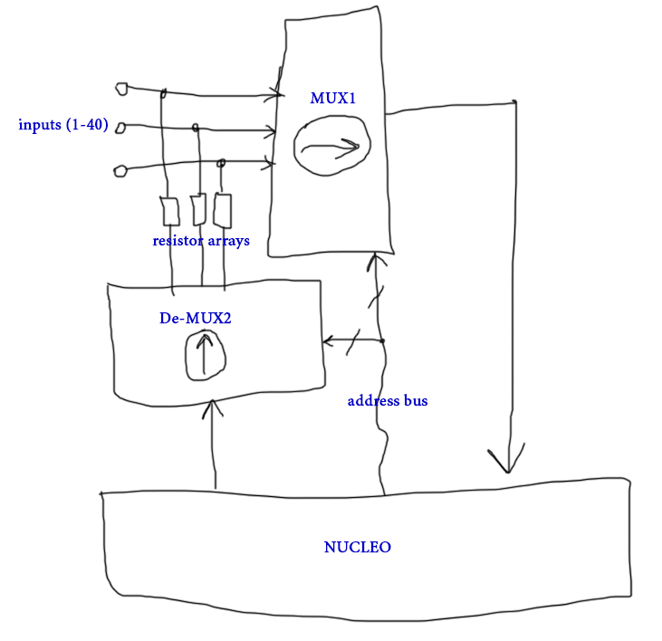

[Interactive Pinout](https://rusefi.com/docs/pinouts/stim/)

## User Manual

* [Download Putty](https://www.chiark.greenend.org.uk/~sgtatham/putty/latest.html)
* bottom microUSB is required for operation
* top microUSB is sometimes needed for firmware updates
* blinking blue LD2 means "alive"
* red LD3 means "board has failed test
* green LD1 next to blinking blue means "test successful"

See https://github.com/rusefi/rusefi-hardware/tree/main/digital-inputs for firmware

Part of https://github.com/rusefi/rusefi infrastucture

https://github.com/rusefi/rusefi/wiki/dev-hardware-quality-control

# Digital Inputs
- 48 channels of high/low digital inputs
- pin requirment: 4 ADC inputs and 9 GPIO

GPIO:
* output: x4 address pins
* output: x4 test control pins
* output: mux off

See https://github.com/rusefi/stim/issues/6

# Changelog

## rev C

* CAN board fix
* second CAN board added
* OUT0 pin moved from PA11 to PD8
* https://github.com/rusefi/stim/issues?q=label%3Arev-C+is%3Aclosed

## rev 0.2

* CAN bus
* superseal header

##  rev 0.1
* it works!

